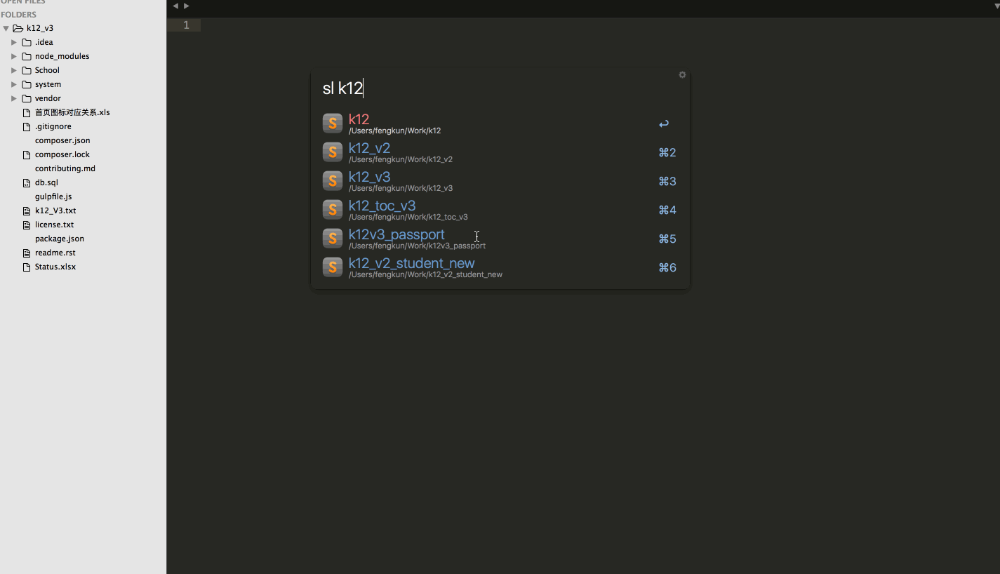
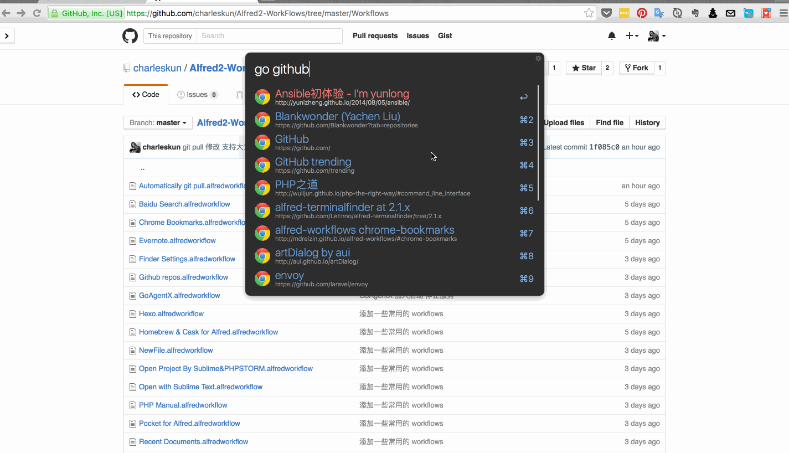

#常用的 workflows  

### [Automatically git pull](https://github.com/charleskun/Alfred2-WorkFlows/blob/master/Workflows/Automatically%20git%20pull.alfredworkflow)

NOTICE:需要在服务端准备好遥操作的 shell.sh 文件。

### [Wunderlist](https://github.com/charleskun/Alfred2-WorkFlows/blob/master/Workflows/Wunderlist.alfredworkflow)

### [Sublime/PhpStorm](https://github.com/charleskun/Alfred2-WorkFlows/blob/master/Workflows/Open%20with%20Sublime%20Text.alfredworkflow)

### [Chrome](https://github.com/charleskun/Alfred2-WorkFlows/blob/master/Workflows/Chrome%20Bookmarks.alfredworkflow)
